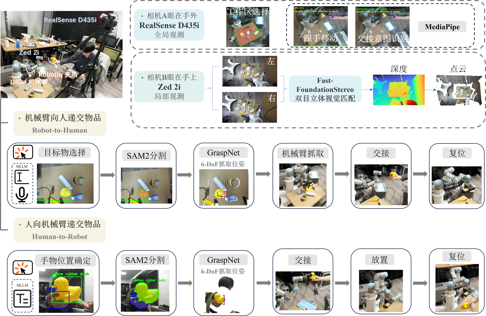

<div align="center">

# UR3e HANDOVER

[中文](#chinese) | [English](#english)

</div>



<span id="chinese"></span>

## 中文

### ✨ 已实现功能

- 🦾 集成 UR3e 与 Robotiq 2F-85夹爪。
- 🤝 人手递给机械臂物品交接流程。
- 🤖 机械臂递给人手物品交接流程。
- 🖼️ 支持 `--debug` 调试模式，保存图片、点云等过程日志。

### 1. 🛠️ 环境配置

> **❗ 注：** 建议先完成基础项目部署。可参考 [UR3e PickPlace 基础仓库](https://github.com/IllusionMZX/UR3e_PickPlace) 和 [UR3e 基础部署教程](https://protective-calendula-c55.notion.site/UR3e-2c3aa15567ec80c6ac5ad8a5c6b1374b?source=copy_link)。

> **❗ 注：** 机械臂运动过程中，务必注意线缆缠绕和周围碰撞风险。如出现异常情况，请立即按下示教器急停按钮，确保机械臂安全。

- **🤖 Robot:** UR3e
- **🦾 Gripper:** Robotiq 2F-85
- **📷 Cameras:** ZED 2i、Intel RealSense D435i
- **🖥️ OS:** Ubuntu 22.04
- **🐢 ROS Version:** ROS 2 Humble
- **🐍 Python:** 3.10
- **💻 环境管理:** Conda
- **🎮 GPU:** NVIDIA GPU + CUDA 12.4 环境

### 2. 🚀 安装与使用

更详细的程序使用教程请参考：[UR3e Handover 使用教程](https://protective-calendula-c55.notion.site/UR3e-368aa15567ec806f9505d4200c1ea5f3?source=copy_link)

```bash
mkdir -p ~/workspace/

cd ~/workspace/

# clone 仓库
git clone https://github.com/IllusionMZX/UR3e_Handover

# 进入工作空间
cd ./UR3e_Handover/

# 创建并激活 conda 环境
conda create -n urho python=3.10
conda activate urho

# 安装 PyTorch
pip install torch==2.6.0 torchvision==0.21.0 xformers --index-url https://download.pytorch.org/whl/cu124

# 安装 Python 依赖
pip install -r requirements.txt

# 手动安装 ZED SDK 和 ZED Python API
# 参考：https://github.com/stereolabs/zed-python-api

# 安装 GraspNet 相关模块
cd src/graspnet-baseline/pointnet2
python setup.py install

cd ../knn
python setup.py install

cd ../../graspnetAPI
pip install .

# 返回工作空间根目录
cd ~/workspace/UR3e_Handover

# 安装 ROS 依赖
rosdep install --from-paths src --ignore-src -r -y

# 构建工作空间
colcon build

# 注意：每运行一个 ROS 命令建议打开一个新终端
# 打开新终端后，先进入工作空间根目录重新加载环境
source install/setup.bash

# 终端 1：连接 UR3e
ros2 launch ur_robot_driver ur_control.launch.py ur_type:=ur3e robot_ip:=192.168.1.10 launch_rviz:=false

# 终端 2：启动 Robotiq 夹爪通信节点
ros2 run robotiq_2f_urcap_adapter robotiq_2f_adapter_node.py --ros-args -p robot_ip:=192.168.1.10

# 终端 3：发布眼在手上标定结果
ros2 launch calibration_result eye_in_hand_zed2i.launch.py

# 终端 4：发布眼在手外标定结果
ros2 launch calibration_result eye_to_hand_rs_d435i.launch.py

# 运行交接脚本
cd src/graspnet-baseline/zedInhand_rsTohand/
python human2robot_handover.py --debug
python robot2human_handover.py --debug
```

- 不加 `--debug` 参数时，默认不保存中间图片和点云结果，程序执行更快。

### 致谢

- [Universal Robots ROS 2 Driver](https://github.com/UniversalRobots/Universal_Robots_ROS2_Driver)
- [MoveIt Calibration](https://github.com/moveit/moveit_calibration)
- [Fast-FoundationStereo](https://github.com/NVlabs/Fast-FoundationStereo)
- [Fast-FoundationStereoPhysics](https://github.com/Vector-Wangel/Fast-FoundationStereoPhysics)
- [SAM 2](https://github.com/facebookresearch/sam2)
- [GraspNet Baseline](https://github.com/graspnet/graspnet-baseline)
- [MediaPipe](https://github.com/google-ai-edge/mediapipe)
- [Volcengine](https://github.com/volcengine)
- [ZED SDK](https://github.com/stereolabs/zed-sdk)
- [librealsense](https://github.com/realsenseai/librealsense)
- [Robotiq 2F URCap Adapter](https://github.com/fzi-forschungszentrum-informatik/robotiq_2f_urcap_adapter)

---

<span id="english"></span>

## English

### ✨ Implemented Features

- 🦾 Integrated UR3e with Robotiq 2F-85 gripper.
- 🤝 Human-to-robot handover pipeline.
- 🤖 Robot-to-human handover pipeline.
- 🖼️ Supports `--debug` mode for saving images, point clouds, and logs.

### 1. 🛠️ Environment Configuration

> **❗ Note:** It is recommended to complete the baseline setup first. Please refer to the [UR3e PickPlace Baseline Repository](https://github.com/IllusionMZX/UR3e_PickPlace) and the [UR3e Setup Guide](https://protective-calendula-c55.notion.site/UR3e-2c3aa15567ec80c6ac5ad8a5c6b1374b?source=copy_link).

> **❗ Note:** During robot motion, pay close attention to cable entanglement and nearby collision risks. If anything abnormal happens, press the Emergency Stop button on the teach pendant immediately.

- **🤖 Robot:** UR3e
- **🦾 Gripper:** Robotiq 2F-85
- **📷 Cameras:** ZED 2i, Intel RealSense D435i
- **🖥️ OS:** Ubuntu 22.04
- **🐢 ROS Version:** ROS 2 Humble
- **🐍 Python:** 3.10
- **💻 Environment Manager:** Conda
- **🎮 GPU:** NVIDIA GPU + CUDA 12.4 environment

### 2. 🚀 Installation and Usage

For a more detailed tutorial, please refer to: [UR3e Handover User Manual](https://protective-calendula-c55.notion.site/UR3e-368aa15567ec806f9505d4200c1ea5f3?source=copy_link)(updating...)

```bash
mkdir -p ~/workspace/

cd ~/workspace/

# Recursively clone the repository, including all submodules
git clone --recurse-submodules https://github.com/IllusionMZX/UR3e_Handover

# Enter the workspace
cd ./UR3e_Handover/

# Create and activate conda environment
conda create -n urho python=3.10
conda activate urho

# Install PyTorch
pip install torch==2.6.0 torchvision==0.21.0 xformers --index-url https://download.pytorch.org/whl/cu124

# Install Python dependencies
pip install -r requirements.txt

# Install ZED SDK and ZED Python API manually
# Reference: https://github.com/stereolabs/zed-python-api

# Install GraspNet-related modules
cd src/graspnet-baseline/pointnet2
python setup.py install

cd ../knn
python setup.py install

cd ../../graspnetAPI
pip install .

# Return to workspace root
cd ~/workspace/UR3e_Handover

# Install ROS dependencies
rosdep install --from-paths src --ignore-src -r -y

# Build workspace
colcon build

# Note: it is recommended to open a new terminal for each ROS command
# After opening a new terminal, go to the workspace root and source the environment again
source install/setup.bash

# Terminal 1: connect UR3e
ros2 launch ur_robot_driver ur_control.launch.py ur_type:=ur3e robot_ip:=192.168.1.10 launch_rviz:=false

# Terminal 2: start Robotiq gripper communication node
ros2 run robotiq_2f_urcap_adapter robotiq_2f_adapter_node.py --ros-args -p robot_ip:=192.168.1.10

# Terminal 3: publish eye-in-hand calibration result
ros2 launch calibration_result eye_in_hand_zed2i.launch.py

# Terminal 4: publish eye-to-hand calibration result
ros2 launch calibration_result eye_to_hand_rs_d435i.launch.py

# Run handover scripts
cd src/graspnet-baseline/zedInhand_rsTohand/
python human2robot_handover.py --debug
python robot2human_handover.py --debug
```

- Without the `--debug` flag, intermediate images and point cloud results are not saved by default, and execution is faster.

### Acknowledgement

- [Universal Robots ROS 2 Driver](https://github.com/UniversalRobots/Universal_Robots_ROS2_Driver)
- [MoveIt Calibration](https://github.com/moveit/moveit_calibration)
- [Fast-FoundationStereo](https://github.com/NVlabs/Fast-FoundationStereo)
- [Fast-FoundationStereoPhysics](https://github.com/Vector-Wangel/Fast-FoundationStereoPhysics)
- [SAM 2](https://github.com/facebookresearch/sam2)
- [GraspNet Baseline](https://github.com/graspnet/graspnet-baseline)
- [MediaPipe](https://github.com/google-ai-edge/mediapipe)
- [Volcengine](https://github.com/volcengine)
- [ZED SDK](https://github.com/stereolabs/zed-sdk)
- [librealsense](https://github.com/realsenseai/librealsense)
- [Robotiq 2F URCap Adapter](https://github.com/fzi-forschungszentrum-informatik/robotiq_2f_urcap_adapter)
